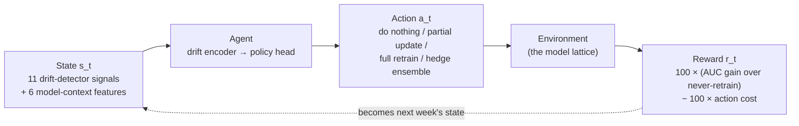
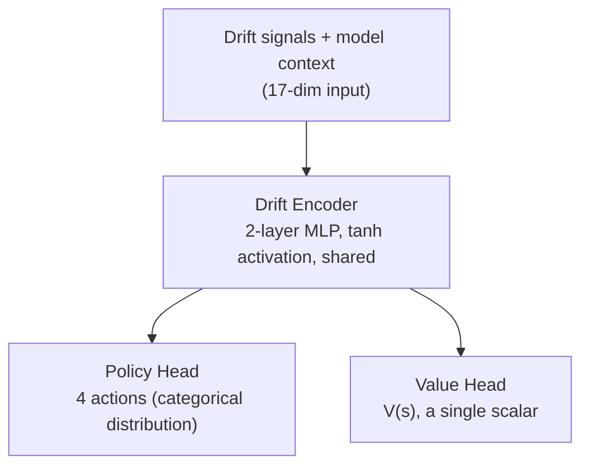

# Learning *When* and *How* to Adapt: Drift Detection and Reinforcement Learning for Fraud Model Retraining

**A research project presentation.** This document walks through the full pipeline —
data, features, modelling, twelve classical drift detectors evaluated as real
retraining policies, and a reinforcement-learning controller built to fix what
those detectors get wrong. Every number and figure below is generated from the
actual pipeline output (`reports/*.csv`), not illustrative.

Companion technical documents, for anyone who wants implementation detail this
presentation intentionally leaves out: [PAPER.md](PAPER.md) (full research
paper), [FEATURE_ENGINEERING_AND_MODELING.md](FEATURE_ENGINEERING_AND_MODELING.md),
[FEATURE_SELECTION_PROCESS.md](FEATURE_SELECTION_PROCESS.md),
[DRIFT_ANALYSIS_EXPLAINED.md](DRIFT_ANALYSIS_EXPLAINED.md).

---

## Table of Contents

1. [Data and Feature Selection](#1-data-and-feature-selection)
2. [Modelling](#2-modelling)
3. [Drift Detection Methods — Pros, Cons, and Results](#3-drift-detection-methods--pros-cons-and-results)
4. [How Reinforcement Learning Solves the Problem](#4-how-reinforcement-learning-solves-the-problem)
5. [What We Gain from RL — Architecture and Results](#5-what-we-gain-from-rl--architecture-and-results)

---

## 1. Data and Feature Selection

### 1.1 The dataset

We use the **IEEE-CIS Fraud Detection** dataset: 590,540 credit-card
transactions spanning roughly six months, starting late November 2017.
Two tables are joined on `TransactionID`:

| Table | Rows | Columns | Contents |
|---|---|---|---|
| `train_transaction` | 590,540 | 394 | Amount, product, card, address, email, engineered "C/D/M/V" blocks, `isFraud` label |
| `train_identity` | 144,233 | 41 | Device and network fingerprint (most transactions have **no** identity row — this table is sparse) |

**Positive-class prevalence is 3.50%.** This single fact shapes almost every
design decision downstream: a naive model predicts "not fraud" for everything
and still looks 96.5% accurate, so every evaluation choice (AUC over accuracy,
a *calibrated* decision threshold, a *class-balanced* error stream for the
monitors) exists specifically to route around this imbalance.

We replay the data as a stream: the **first 90 days** become a reference/
baseline window, and the remaining data is split into **14 consecutive 7-day
windows** — a weekly production cadence.

### 1.2 From 432 raw columns to 113 trained features

After the join, 432 raw predictor columns remain (excluding the join key and
the label). These fall into a few very differently-shaped blocks:

| Raw block | Columns | What it is | What survives engineering |
|---|---|---|---|
| **V1–V339 (Vesta)** | 339 | Vesta's own opaque, highly collinear engineered features | Compressed to 4: 2 PCA components + a missing-count + a fixed-subset sum |
| **Identity / device** | 40 | Device type, device info, 38 anonymised `id_` network/behaviour signals | 38 (2 dropped as near-constant) |
| **C1–C14 (counters)** | 14 | Counts of things tied to the card/address (semantics undisclosed) | Replaced by 3 pattern features + 13 frequency encodings |
| **D1–D15 (timedeltas)** | 15 | Days since some prior event, per entity | 16 (14 columns + 2 missingness-pattern features; 1 dropped as near-constant) |
| **M1–M9 (match flags)** | 9 (8 used) | Whether name/address on the card matches billing/shipping | 8 (kept + 1 missingness-pattern feature) |
| **Everything else** | 15 | `TransactionAmt`, `ProductCD`, `card1`–`card6`, `addr1/2`, `dist1/2`, email domains, `TransactionDT` | Kept, transformed, or combined into ~31 features |

The 339-column Vesta block alone is 78% of the raw predictor space — which is
why aggressive compression, not per-column treatment, is the right strategy
for it specifically.

**What each surviving feature group actually carries as information:**

| Group | Information content |
|---|---|
| **Distance** | How far the billing address is from the shipping address (log-scaled) — a classic fraud tell (mismatched geography) |
| **Temporal** | Cyclic hour-of-day and weekday×hour — captures time-of-day fraud patterns without a hard 23→0 discontinuity |
| **Entity / causal sequence** | Seconds since this card last transacted, % change in amount vs. its last transaction, and its position in its own transaction history — velocity and behavioural-consistency signals, computed causally (no future leakage) |
| **Amount** | The transaction amount, its log, its cents portion, and how many decimal places were written — structuring/laundering signals live in the last two |
| **Aggregates** | Mean/max/variance of amount per email-domain × product-code group, frozen from the reference window — "is this amount typical for this kind of purchase?" |
| **Frequency** | How common a given counter value was during training — rare combinations stand out |
| **Counter / timedelta / match patterns** | Not just *how many* are zero/missing, but *which* — the pattern itself is informative, not just the count |
| **Vesta block** | 2 principal components of 339 opaque engineered features, plus how much of that block is missing — compressed, not discarded |

### 1.3 The representation is frozen — and this is the single most important decision in the whole project

Six of the engineering stages **learn** something from the data they see: the
group-aggregate maps, the frequency-encoding maps, the Vesta PCA rotation, the
near-constant-column filter, and the categorical-to-integer maps. All of these
are fit **once**, on the 90-day reference window, and **replayed unchanged**
on every later week — never refit. Refitting any of them per window
manufactures fake "drift" that is really just the encoder changing under your
feet (a category re-numbered by order of appearance, a PCA axis flipping
sign, a frequency changing because the window got smaller).

We proved this mattered with a **null experiment**: split one window into two
random halves — no real drift can exist between two random halves of the same
data — and count how often the pipeline alarms anyway.

| Encoder fitting | False-alarm rate |
|---|---|
| Refit per window (the naive design) | **35.4%** of features |
| Fit once, frozen (our design) | **0.9%** of features |

A pipeline that alarms on more than a third of its features when nothing has
happened is not measuring drift — it's measuring itself.

### 1.4 Selecting the monitoring set: 113 → 20 features

The model *trains* on all 113 features. But monitoring all 113 for drift
every week would be expensive (per-feature statistical tests, SHAP
attribution) and self-defeating (many of the 113 are near-duplicates of each
other, so a "6 of 10 features drifted" vote could really be one signal
counted six times).

The monitoring set is chosen by:

1. **Bagged importance** — 5 LightGBM fits on bootstrap resamples; a feature
   that every fit independently ranks highly is a property of the data, not
   of one fit's randomness.
2. **SHAP corroboration** — a second, cardinality-unbiased importance signal.
3. **A monitorability filter** — drop anything with fewer than 10 distinct
   values or near-zero variance (a statistical test can't say anything about
   those).
4. **Two-level redundancy pruning** — pairwise Spearman correlation ≥ 0.90 is
   rejected, **and** no more than 2 features from the same "numbered family"
   (e.g. `_freq_ref_C1`...`_freq_ref_C14` are one family) may be selected —
   this second rule was added after we found the *first* 10-feature monitoring
   set had **four** members of one family voting as if independent.

The set size was increased from an initial 10 to **20**. We checked whether
that is actually safe: a repeated null-experiment check (30 random splits, no
drift possible) found **0% false positives** on the 20-feature set — there is
no calibration cost to watching more features, only broader coverage.

> ### 🎤 Speaker Notes — Section 1
>
> - Open with the imbalance number (3.5%) — it explains almost every other
>   design choice later in the talk (calibrated threshold, class-balanced
>   error stream, AUC over accuracy), so plant it early.
> - The funnel chart (432 → 113 → 20) is the one visual to slow down on. Two
>   compressions are happening for *different reasons*: 432→113 is "make the
>   data usable for a model" (the Vesta block alone is 339 of those 432 raw
>   columns); 113→20 is "make it cheap and statistically sound to watch for
>   drift." Don't let the audience conflate the two.
> - The null-experiment number (35.4% → 0.9%) is the single most important
>   result to state plainly: it means that *most published drift-detection
>   demos, if they refit encoders per window, are measuring their own
>   pipeline, not the world.* This is the credibility foundation for
>   everything that follows in Section 3 — without it, nobody should trust
>   any of the confirmed-alarm counts we report there.
> - If asked "why 20 and not 50 or all 113?" — the honest answer is: 20 was a
>   deliberate, checked expansion from an initial 10, not a tuned optimum. We
>   verified it's *safe* (0% false positives under the null) but didn't
>   search for an "ideal" K. That's a fair thing to say to a professor —
>   better than pretending it was optimised.

---

## 2. Modelling

Two classifiers appear in this project, for two different reasons.

### 2.1 The classical model — LightGBM (used by all 12 drift detectors)

| Hyperparameter | Value | Why |
|---|---|---|
| Learning rate | 0.01 | Slow, stable learning |
| Boosting | Gradient-boosted trees, 64 leaves | Standard tabular baseline |
| `is_unbalance` | True | Built-in class weighting for 3.5% prevalence |
| Validation split | **Temporal** (last 20% by time), not random | A random split leaks same-day/same-card rows across the boundary via entity features, giving early stopping an over-optimistic target |
| Early-stopping patience | **100 rounds** | See the bug story below |
| Decision threshold | **Calibrated** by F1-maximising sweep on the validation split, not fixed at 0.5 | See the bug story below |

**A bug worth telling as a cautionary story.** The first version of this
project used an early-stopping patience of 5 rounds. At a learning rate of
0.01, validation AUC barely moves in the first few dozen rounds — so patience
5 halted training at **iteration 1**: every reported model was a single
decision tree. Combined with a fixed 0.5 decision threshold (which, at 3.5%
prevalence, puts almost no probability mass above the line), **every model
had F1 = 0.0000 on every single evaluation window.** Three of the twelve
drift detectors (DDM, EDDM, HDDM) watch the model's *error stream* — with a
constant-output model, that stream carries zero information, so those three
detectors were, unknowingly, monitoring a constant. Fixed by raising patience
to 100 and calibrating the threshold; validation F1 moved from 0.000 to ≈0.47.

A **shared model registry** trains at most **one model per week**, and every
detector that flags drift that week gets handed the identical fitted model —
not twelve independent, differently-seeded fits of the same data. This caps
the number of distinct models at `1 + n_weeks` (15 for this 14-week replay)
regardless of how many detectors are running, and guarantees that two
detectors retraining in the same week are compared against *bit-identical*
models.

### 2.2 The neural model — for the RL agent

A 3-layer MLP (256→128→64→1), BatchNorm + dropout, trained with a
positive-class-weighted loss and the same temporal-split/calibrated-threshold
discipline as the LightGBM model.

**Why switch models at all — the classical model isn't reused for RL?**
Because **a gradient-boosted forest cannot be partially updated.** Adding
trees to an existing booster is a different operation from adapting it — there
is no principled "fine-tune this forest on last month's data." With a GBDT,
the RL agent's action space collapses from four meaningful choices down to
two (retrain / don't), and the entire question this project asks — not just
*whether* to adapt, but *how* — disappears. A differentiable model makes a
cheap partial update a real, few-gradient-steps operation, and — critically —
makes its cost *measurable* (Section 5).

> ### 🎤 Speaker Notes — Section 2
>
> - The early-stopping bug is worth telling in full, even though it's
>   embarrassing, because it's the best evidence in the whole project for why
>   rigorous checking matters — three drift detectors were silently broken by
>   it, and none of that was visible from code review alone; a validation
>   metric caught it.
> - If your professor asks "why not just use LightGBM for the RL agent too,
>   with a smaller action space?" — that's a completely fair question, and the
>   honest answer is in Section 5's results: the action space (partial update)
>   turns out to be responsible for ~92% of the RL agent's advantage. Without
>   a differentiable model, that 92% simply isn't available to capture. This
>   is the strongest justification for the model switch, and it's an
>   *empirical* one, not an architectural preference.
> - The shared registry point is a systems/engineering contribution as much
>   as a modelling one — worth mentioning if the audience cares about
>   production feasibility, not just accuracy numbers.

---

## 3. Drift Detection Methods — Pros, Cons, and Results

We implemented and evaluated **12 classical drift detectors**, organised by
what they observe:

| # | Detector | Family | Observes | Needs labels? |
|---|---|---|---|---|
| 1 | KS test | Distributional | Feature marginals | No |
| 2 | PSI | Distributional | Binned marginals | No |
| 3 | Jensen-Shannon | Distributional | Binned marginals | No |
| 4 | DDM | Performance | Error stream | Yes |
| 5 | EDDM | Performance | Inter-error distances | Yes |
| 6 | HDDM | Performance | Error stream (Hoeffding bound) | Yes |
| 7 | ADWIN | Performance-adjacent | Prediction stream | No |
| 8 | SHAP / attribution | Explanation | Attribution distributions | No |
| 9 | Clustering | Representation | Joint feature geometry | No |
| 10 | Autoencoder | Representation | Reconstruction error | No |
| 11 | Prequential AUC | Performance | Ranking quality | Yes |
| 12 | Champion vs Challenger | Shadow model | Value of retraining | Yes |

Each was run as a genuine **retraining policy** over the 14-week replay — not
just "does it alarm," but "if you retrain whenever this detector confirms,
what AUC do you actually get." A **2-of-2 persistence gate** requires a
detector to fire in 2 consecutive windows before triggering a retrain, so a
one-off blip doesn't cause action.

### 3.1 Which detectors actually fired

**Only 4 of the 12 detectors ever confirmed drift.** KS, PSI, Jensen-Shannon,
DDM, HDDM, SHAP, Clustering, and Autoencoder stayed silent for the entire
14-week replay.

The full week-by-week picture, every detector, every week:

**The headline finding: this is concept drift, not covariate shift.** Every
detector that looks only at *feature distributions* stayed silent, while
every detector that watches the *model's behaviour* (error rate, ranking
quality, prediction stream) fired repeatedly. In plain terms: the
transactions in week 9 look statistically like the transactions in the
reference window — same distributions of amount, product, device, etc. — but
*what makes a transaction fraudulent* changed. A production system that only
monitors input distributions (the most common setup, because it needs no
labels) would have shown a flat, reassuring dashboard for six months while
the model quietly decayed.

### 3.2 Method-by-method: pros, cons, and what actually happened here

The four detectors that vote across the monitored feature set (KS, PSI,
Jensen-Shannon, SHAP) never come close to their own 0.60 consensus line, in
any week:

| Detector | Best at | Blind to / fails when | Result on this stream |
|---|---|---|---|
| **KS test** | Abrupt shift in a continuous feature | Concept drift entirely; over-sensitive at large sample sizes (flagged 14/14 weeks before we fixed the sample-size artifact) | **0/14 weeks.** Feature-crossing fraction stayed at 0.15–0.45, never near the 0.60 consensus line |
| **PSI** | Gradual population shift, interpretable magnitude | Concept drift; its 0.10/0.20 folklore bands assume an unstated sample size | **0/14 weeks.** Lowest fraction of the three distributional tests every week |
| **Jensen-Shannon** | Same job as PSI/KL, but bounded and symmetric | Concept drift | **0/14 weeks.** Closest of the three to the line (0.50 at week 12) but never crosses |
| **DDM** | Abrupt degradation on balanced problems | Hides degradation in the majority class; harder to trigger the longer a model is stable — backwards from what you want | **0/14 weeks confirmed.** |
| **EDDM** | Gradual degradation, earliest warning | Very noise-sensitive at default settings (13/14 weeks before correction) | **4/14 weeks confirmed** (2, 10, 12, 14) — the most retrain-happy detector this run |
| **HDDM** | Staying sensitive on long-stable models; distribution-free guarantee | Conservative by design | **0/14 weeks, and 0 even at the raw-alarm level** — the only detector that never once triggered, in any version of this experiment |
| **ADWIN** | Mean shift in the prediction stream, formal guarantee | Fires on turbulence, which isn't the same as staleness | **12/14 raw alarms, 5/14 confirmed** — as a *retraining policy* this is worse than randomly-timed retraining at equal cost |
| **SHAP / attribution** | The *only* label-free signal with real reach into concept drift — sees what the model relies on shifting | Expensive; blind to drift that doesn't change attributions | **0/14 weeks** at the (corrected) 20-feature set — an earlier, smaller, more redundant monitoring set had produced one confirmed alarm that turned out to be substantially a redundancy artifact |
| **Clustering** | Multivariate shifts no single-feature test can see | Needs standardisation or the largest-scale feature dominates | **0/14 confirmed**, but its one raw alarm (week 12) is the largest reading in its own table by a wide margin — corroborated independently by the autoencoder and by a raw feature outlier the same week |
| **Autoencoder** | Genuinely novel regions of feature space | Reconstruction-error tests over-trigger without an effect-size floor | **0/14 weeks**, but its reconstruction error also peaks sharply at week 12 — the same event Clustering flags |
| **Prequential AUC** | Measures what actually matters, directly | Strictly reactive — can't fire until damage is already visible | **12/14 raw, 6/14 confirmed** — the most persistence-confirmed alarms of any detector, but retrains 6 times for a worse mean AUC than the best 2-retrain policy |
| **Champion vs Challenger** | Answers the real question ("would retraining help") directly | Naive in-sample scoring inflates the challenger and causes constant false alarms — must use out-of-fold scoring | **2/14 confirmed** (weeks 2, 8) — the single best classical retraining policy this run |

### 3.3 Which specific features are actually drifting, and how often

Rather than just counting *how many* features cross threshold each week, we
tracked *which* ones:

Three features cross their own threshold in **14 of 14 weeks**, individually,
under multiple detectors at once: `_mcols_na_bin` (the missingness pattern
across match-flag columns) and the two Vesta PCA components. We investigated
each rather than assuming they were real drift, and found two different
mechanisms:

- **A real bug, found and fixed.** Two "days-since-event" columns (`D2`,
  `D15`) were computed as `raw_value − days_elapsed_since_dataset_start`.
  Since the raw value is roughly *stationary* over time but the subtracted
  quantity grows *linearly*, this manufactured a fake trend out of nothing —
  `D2` alone went from crossing threshold in 14/14 weeks to 2/14 once we
  removed the bad subtraction. This is the same "monotone-in-time proxy"
  problem that `TransactionDT` itself is deliberately excluded from the model
  for — just reintroduced here through a transformation, not a raw
  timestamp.
- **Real, but not drift in the usual sense.** `_mcols_na_bin` and the Vesta
  components show a one-time *step* between the 90-day reference window and
  week 1 that then stays flat — not a progressive ramp. The most defensible
  explanation: the reference window spans the dataset's **holiday-season**
  start (late November–February), and later weeks don't. The "drift" these
  three features report is most likely the reference window itself being
  seasonally unrepresentative of the rest of the year — a real, corroborated
  signal, but not the kind of drift a retraining policy should chase every
  week.

### 3.4 Classical detectors as retraining policies — the surprising result

Detecting drift and knowing when to *retrain* are not the same question.
Turning each detector into a real policy and measuring out-of-sample AUC:

| Policy | Retrains | Mean AUC | vs. randomly-timed policies of equal cost |
|---|---|---|---|
| **Champion vs Challenger** | 2 | **0.8819** | 81st percentile |
| EDDM | 3 | 0.8776 | 21.5th percentile |
| Prequential AUC | 6 | 0.8760 | 20th percentile |
| ADWIN | 5 | 0.8733 | 5.5th percentile |
| *Always retrain (all 13 weeks)* | 13 | 0.8726 | — |
| *Never retrain* | 0 | 0.8725 | — |

Two findings stand out:

1. **Retraining every single week buys statistically nothing** — 13 retrains
   improve mean AUC by +0.0001 over never retraining. Two *well-timed*
   retrains improve it by +0.0094 — roughly two orders of magnitude the
   benefit, at 15% of the cost.
2. **Detectors that retrain more than twice a replay are worse than a coin
   flip at the same budget.** ADWIN, at 5 retrains, sits at just the 5.5th
   percentile of randomly-timed policies spending the same budget — you would
   have beaten it ~94.5% of the time by picking retraining weeks at random.
   Without that random-policy comparison, ADWIN would look like a success
   story (it does beat never-retraining) — this is exactly why the comparison
   matters.

> ### 🎤 Speaker Notes — Section 3
>
> - Lead with the confirmed-alarms bar chart, then immediately pivot to the
>   heatmap — the bar chart tells you *what*, the heatmap tells you *when and
>   how persistent*. The heatmap is the visual to leave on screen the longest;
>   it's the one that makes "concept drift, not covariate shift" visually
>   obvious (the top rows — all distributional/representation detectors — are
>   just empty).
> - The D-column bug story is a great moment to pause on if the professor is
>   evaluating rigor, not just results — it demonstrates we didn't just trust
>   "the model looks done," we went back and audited *why* specific features
>   kept flagging, and found a real defect. This is the kind of thing a
>   reviewer wants to see: results that survived being doubted.
> - Be ready for "so which detector should I use in production?" The honest
>   answer, and the one to give: *it depends what kind of drift you expect,*
>   and on this dataset the answer would have been "none of the label-free
>   ones" — which is uncomfortable, because label-free monitoring (no waiting
>   for ground truth) is what most production systems actually run. That
>   discomfort is exactly the motivation for Section 4.
> - The random-control percentile point (ADWIN at the 5.5th percentile) is the
>   single most persuasive number in this section for a skeptical audience —
>   it's the concrete evidence that "detects real drift" and "makes a good
>   retraining trigger" are different claims.

---

## 4. How Reinforcement Learning Solves the Problem

### 4.1 The reframing

Every one of the 12 detectors above answers the same kind of question: **"has
drift occurred?"** — a one-shot, binary classification problem. But the
operator's actual question is different: **"given everything I've observed,
and the model I currently have, what should I do this week?"** — a
*sequential decision* problem. These differ in three concrete ways no
detector's design accounts for:

1. **The right action depends on the model's own state, not just the data.**
   The same drift signal justifies an urgent retrain if the model is six
   months stale, and justifies nothing if it was rebuilt last week. No
   detector tracks its own model's age.
2. **The choice isn't binary.** Between "do nothing" and "rebuild from
   scratch" there is a cheap fine-tune and a free ensemble re-weighting — real
   options every classical detector's design ignores.
3. **Actions have delayed consequences.** Retraining during a turbulent week
   permanently folds that turbulence into a cumulative training set, and the
   cost shows up weeks later, not immediately. Section 3.4 already showed
   this mechanism at work — busy detectors retrain into noise.

This is precisely the structure of a **Markov Decision Process**, so we frame
it as one and learn the policy with reinforcement learning, instead of hand-
tuning a threshold.

### 4.2 The MDP formulation

**State** deliberately mixes *all twelve* detectors' continuous outputs
(not booleans — "PSI is 0.19" and "PSI is 0.02" are both "no drift" to a
threshold rule, and obviously different to a learner) with model-context
features: weeks since the last full retrain, weeks since the last partial
update, the current ensemble weight, recent AUC and F1, and progress through
the replay.

**Action space** — four choices, only possible because the underlying model
is differentiable (Section 2.2):

| Action | Effect | Relative cost |
|---|---|---|
| Do nothing | Keep the current model | Free |
| Partial update | Fine-tune the last *full* model on the recent 4 weeks | Cheap |
| Full retrain | Rebuild on all data seen so far | Expensive |
| Hedge ensemble | Shift weight from the current model toward the stable baseline | Free |

**Reward** is realised performance improvement over a never-retrain baseline,
minus the action's cost. A decision made in week *t* is graded starting week
*t+1* — grading it on its own week would let the agent retrain on data it has
already been scored against.

### 4.3 Why this needed a model change, and why PPO

We use **Proximal Policy Optimization (PPO)**: the action space is small and
discrete, episodes are only 14 steps, so sample efficiency isn't the binding
constraint — *stability* is, and PPO's clipped objective prevents any single
noisy batch from over-correcting the policy, which matters when the entire
dataset is one 14-week trajectory replayed under different choices.

**Making PPO trainable on 14 weeks at all** required one further trick: under
this action set, the model in force at any point is fully determined by three
numbers — `(last full-retrain week, last partial-update week, ensemble
weight)`. That space is small and enumerable, so we precompute **every**
reachable model once (the "model lattice"), cache what each one scores on
every future week, and the training environment becomes a lookup table.
Episodes then cost nothing to simulate, which is what makes thousands of PPO
episodes affordable on a 14-window dataset.

> ### 🎤 Speaker Notes — Section 4
>
> - The three-point list (model-state-dependence, non-binary choice, delayed
>   consequences) is the intellectual core of the whole project — if the
>   audience only remembers one slide's worth of content, make it this one.
>   Everything in Section 3 is evidence *for* points 2 and 3 specifically
>   (busy detectors retrain into noise = delayed consequences; no detector
>   knows if the model is already fresh = state-dependence).
> - The mermaid diagram is a genuine causal loop, not just decoration — trace
>   it out loud: state → action → reward → *becomes* next state. Emphasise
>   that the reward is graded one week *later* than the decision — that's the
>   detail that prevents the agent from cheating.
> - If asked "why not just use a bigger/more complex model for the agent" —
>   the model lattice trick is the answer: the *environment* being reducible
>   to a lookup table is what makes this tractable at all on 14 data points;
>   a bigger network wouldn't fix the more fundamental problem of having very
>   little data to learn from, and might overfit worse.
> - Good moment to explicitly name the limitation: 14 decision points is
>   very few for a reinforcement-learning problem. We address this directly
>   in Section 5 rather than hiding it — the ablation study result there is
>   presented as fragile *because* of this small-sample reality.

---

## 5. What We Gain from RL — Architecture and Results

### 5.1 Agent architecture

The encoder is **shared** between the policy and value heads deliberately:
with only 14 data points to learn from, the value head's gradient becomes
extra supervision for the same small encoder, rather than each head having to
learn its own representation from scratch. Trained with PPO: clipped
surrogate objective, generalised advantage estimation, an entropy bonus to
keep exploring, and gradient-norm clipping for stability. Exploration is
epsilon-greedy during training (annealed from 0.30 to 0.02) and Thompson
sampling (drawing from the learned action distribution rather than always
taking the top choice) as a production-safe alternative.

### 5.2 Benchmark results

Every policy below — classical detector, naive control, or the RL agent —
acts on the **same neural classifier and the same precomputed model lattice**,
so differences come from decisions, not training randomness or lucky seeds.

The RL agent tops the benchmark at **0.8831 mean AUC**, against **0.8696**
for the best classical detector (ADWIN, under this model) and **0.8523** for
never retraining.

### 5.3 The honest decomposition — where does that gain actually come from?

The chart above hides an uncomfortable detail: the **"always partial
update"** policy — fine-tune every single week, no learning, no drift signals,
no decisions at all — reaches **0.8820**, just 0.0011 AUC behind the full
learned agent.

**Roughly 92% of the RL agent's advantage over the best classical detector
comes from simply *having* a cheap adaptation action available — not from
the learning itself.** A naive "fine-tune every week" policy captures almost
all of it. This is worth stating plainly rather than leading only with the
headline number, because "RL beats every classical detector by 0.0135 AUC" is
true and, on its own, would give a misleading impression of what earned that
result.

### 5.4 Do the drift detectors actually matter? Yes — but we only know that because we checked, and got it wrong once first

We trained three identical agents, differing only in what they can observe:

The pattern is exact, not approximate: **"context only" (no drift signals)
lands on precisely the naive always-partial-update policy — it gains nothing
from having model-context features without drift signals. "Signals only" (no
model context) lands on precisely the full agent's performance** — the drift
signals alone are sufficient to recover the entire learned-policy advantage.

**This result reversed once already**, on an earlier, buggy version of the
feature pipeline (before the D-column bug in Section 3.3 was fixed, and
before the monitoring set was widened from 10 to 20 features). That earlier
run found the *opposite* — model context alone reproduced almost all of the
full agent's performance, and dropping the drift signals cost almost
nothing. We initially reported that as a negative result for feeding
detector outputs to a learned controller. **We no longer believe that
conclusion** — it was measured on a feature pipeline with a real defect in
it. We consider the *reversal itself* more important than either individual
result: a single feature-engineering bug and one redundancy fix were enough
to flip a qualitative conclusion, on only 14 data points. Any claim drawn
from an experiment this small should be treated as directionally suggestive,
not as a settled fact — and this project has direct, empirical evidence for
that caution, not just a theoretical worry about it.

**What the agent's decisions actually rely on:**

`progress` (position in the replay — essentially, "what week is it") is still
the single largest driver, but far less dominant than in the earlier, buggy
run (previously 4× the next-largest input; now under 3×) — and **two genuine
drift signals now sit inside the top six inputs**, rather than being crowded
out entirely.

### 5.5 Catastrophic forgetting — measured, not assumed

Because the agent can compare "trust the fine-tuned model fully" against
"blend it back toward the stable baseline," forgetting becomes a number
instead of an assumption:

| Quantity | Value |
|---|---|
| Cases evaluated | 139 |
| Cases where hedging would have recovered some AUC | 139 (all of them) |
| Maximum AUC recoverable by hedging | 0.0089 |
| Mean AUC recoverable (where positive) | 0.0020 |
| Best correction is usually gentle (α = 0.75) | 119 of 139 cases |

Forgetting is real but mild here — a direct consequence of a design choice:
partial updates always branch from the last **full** model, never chain from
the previous partial update, so damage from a bad fine-tune cannot compound
across weeks. Notably, the trained agent **never actually used the free hedge
action** in its final policy, despite this measured, recoverable benefit —
a real but modest missed opportunity in what the learned policy captured.

### 5.6 Summary — what RL actually bought us

1. **A better ceiling.** 0.8831 vs. 0.8696 best-classical vs. 0.8523
   never-retrain, with the best worst-week performance of any policy — the
   week fraud losses would actually spike.
2. **Mostly, a cheaper way to adapt, not a smarter detector.** ~92% of the
   gain over the best classical detector is available to *any* system with a
   partial-update option, whether or not it uses learning at all.
3. **A small but now-real role for the drift detectors** — necessary and
   sufficient for the last ~8% of the gain, once measurement was fixed.
4. **Forgetting turned from an assumed hazard into a measured quantity** —
   up to 0.0089 AUC recoverable by hedging, on this stream.
5. **A methodological lesson bigger than any single number**: a project this
   size (14 decision points) can flip its own qualitative conclusions from
   one bug fix. That fragility is not a flaw to hide — it's the strongest
   argument in the whole project for calibration checks (Section 1.3) and
   ablations (Section 5.4) as required steps, not optional polish.

> ### 🎤 Speaker Notes — Section 5
>
> - Show the benchmark chart first, let it land, *then* show the gain-
>   decomposition chart immediately after — the sequence "RL wins" →
>   "here's why that's not the whole story" is the intended rhetorical
>   structure, and it's much more convincing delivered in that order than if
>   you lead with the caveat.
> - The ablation reversal (5.4) is the most sophisticated result in the
>   project and the one most likely to draw follow-up questions. Have the
>   specific numbers ready: pre-fix, signals contributed +0.0011 AUC and
>   removing them cost nothing; post-fix, removing them costs the *entire*
>   learned-policy gain. Be ready to say plainly: "we do not know if a third
>   bug fix would flip it again — that's exactly the point we're making about
>   small-sample fragility."
> - If your professor pushes on "so is RL worth it or not" — the honest,
>   defensible answer: *worth it for the ceiling and for making forgetting
>   measurable; not worth it if the only alternative under consideration is
>   'give a classical detector a cheap partial-update option too' — most of
>   the win is available without any learning at all.* That's a more
>   interesting and more defensible claim than "RL wins," and it's the actual
>   finding.
> - Close on point 5 in the summary — a project that can honestly report its
>   own result reversing is a stronger research artifact than one that
>   reports a single clean number, and that's a good note to end a
>   presentation on for an academic audience.
